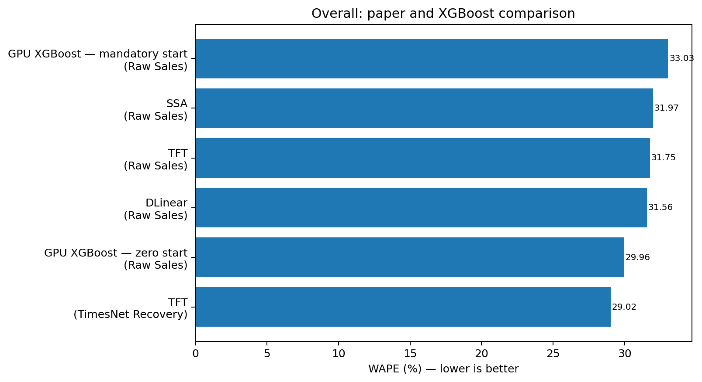

# FreshRetailNet-50K Forecasting with GPU XGBoost and Temporal Feature Selection

This repository evaluates two full-data GPU XGBoost forecasting frameworks on
FreshRetailNet-50K:

1. **Mandatory start:** five predictors are imposed before forward selection.
2. **Zero start:** selection begins from an intercept-only baseline and all 57
   individual features must earn inclusion.

Both experiments use the complete 50,000-series dataset, evaluation-like seven-day
temporal validation, initial Optuna tuning, frozen hyperparameters during forward
selection, final Optuna tuning with L1/L2 regularization, and the untouched official
evaluation split.

> **Important:** these experiments forecast **raw recorded sales**. They do **not**
> reproduce the paper's TimesNet latent-demand recovery stage.

## Headline results

Paper-comparable results use uncensored target days from the official seven-day
evaluation.

| Sales group | Mandatory-start XGBoost | Zero-start XGBoost | Best paper raw-sales model | Paper TFT + TimesNet |
|---|---:|---:|---:|---:|
| Overall WAPE | 33.03% | **29.96%** | DLinear: 31.56% | **29.02%** |
| Low-sale WAPE | 38.94% | **36.10%** | TFT: 37.04% | 37.33% |
| High-sale WAPE | 28.74% | **25.50%** | DLinear: 25.68% | **23.03%** |
| Overall WPE | -5.13% | -6.82% | DLinear: -4.89% | +2.58% |
| Low-sale WPE | +3.11% | **-1.15%** | DLinear: -1.03% | +7.78% |
| High-sale WPE | -11.12% | -10.93% | DLinear: -7.63% | **+0.87%** |

### Main findings

- **Zero start beats mandatory start in WAPE, MSE, MAE, and RMSE for all three
  sales groups.**
- Zero-start XGBoost beats every paper **raw-sales** baseline in WAPE:
  - overall: 1.60 percentage points better than DLinear;
  - low sale: 0.94 points better than TFT;
  - high sale: 0.18 points better than DLinear.
- Against the paper's different two-stage **TimesNet recovery + TFT** system:
  - zero start is 0.94 points worse overall;
  - 1.23 points better for low-sale series;
  - 2.47 points worse for high-sale series.
- The remaining weakness is **high-sale underprediction**: zero-start WPE is
  -10.93%, while TFT + TimesNet is near unbiased at +0.87%.

The full model-by-model comparison, relative differences, ranks, and bias discussion
are in [`docs/PAPER_COMPARISON.md`](docs/PAPER_COMPARISON.md).



## What the TimesNet comparison means

The paper's TimesNet result is not just another forecasting model. It is a two-stage
pipeline:

```text
hourly observed sales + stock status + covariates
        -> TimesNet latent-demand recovery
        -> recovered daily demand
        -> TFT forecasting
```

This repository instead uses:

```text
raw observed daily sales + causal engineered predictors
        -> GPU XGBoost forecasting
```

`stockout_roll_mean_14` helps XGBoost recognize recent stockout pressure, but the
training target remains censored raw sales. Therefore:

- the primary apples-to-apples comparison is with **SSA raw**, **TFT raw**, and
  **DLinear raw**;
- TFT + TimesNet is an informative reference for the value of explicit latent-demand
  recovery, especially for high-sale products;
- this repository does not claim to reproduce, replace, or validate TimesNet.

See [`docs/TIMESNET_SCOPE.md`](docs/TIMESNET_SCOPE.md).

## Selected zero-start features

| Order | Feature | Interpretation |
|---:|---|---|
| 1 | `sales_roll_mean_7` | recent weekly demand level |
| 2 | `store_id` | persistent store-level effects |
| 3 | `rain_x_holiday` | context-dependent weather effect |
| 4 | `product_id` | product-specific demand scale and pattern |
| 5 | `future_discount` | known promotion intensity |
| 6 | `stockout_roll_mean_14` | recent stockout and censoring pressure |
| 7 | `sales_origin` | latest observed demand state |

The set is meaningful for seen-store/seen-product forecasting, but identity features
do not establish cold-start generalization. Detailed interpretation is in
[`docs/FEATURES.md`](docs/FEATURES.md).

## Does zero-start selection make sense?

Yes, as an ablation and feature-selection design. The zero-feature model is an
intercept-only training-mean baseline, not the final model. It makes every feature
demonstrate incremental predictive value rather than imposing assumptions.

However, the executed notebooks reset temporal chunks after accepted features and use
the historical `uploaded_notebook` acceptance rule. Candidate rankings within a step
are valid, but improvement values across resets are not perfectly paired. A
same-reset confirmatory configuration is included under `configs/`.

## Repository map

```text
notebooks/
  01_mandatory_start.ipynb
  02_zero_start.ipynb
  03_paper_comparison.ipynb
  executed/                    original completed runs with outputs
results/
  full_benchmark_ranking.csv
  pairwise_comparison_vs_each_paper_model.csv
  our_evaluation_all_subsets_and_horizons.csv
  horizon_comparison_uncensored_overall.csv
  feature_selection_path.csv
  selected_features_and_interpretation.csv
docs/
  PAPER_COMPARISON.md
  TIMESNET_SCOPE.md
  FEATURES.md
  METHODOLOGY.md
  LIMITATIONS.md
figures/
src/
tests/
configs/
```

## Reproduce

Use a Colab GPU runtime and run either clean notebook from top to bottom. The complete
search is expensive because it evaluates all 50,000 series, multiple temporal folds,
57 feature candidates, and two Optuna stages.

```bash
pip install -r requirements.txt
pytest
python scripts/build_figures.py
```

## Data, upstream project, and attribution

The dataset is not redistributed.

- Dataset: `Dingdong-Inc/FreshRetailNet-50K`
- Official baseline: `Dingdong-Inc/frn-50k-baseline`
- Paper: *FreshRetailNet-50K: A Stockout-Annotated Censored Demand Dataset for
  Latent Demand Recovery and Forecasting in Fresh Retail*

This repository is an independent extension focused on GPU XGBoost, structured
temporal validation, Optuna optimization, and forward-feature-selection ablations.
