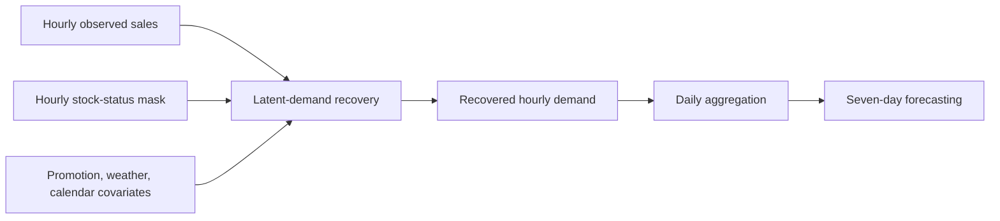
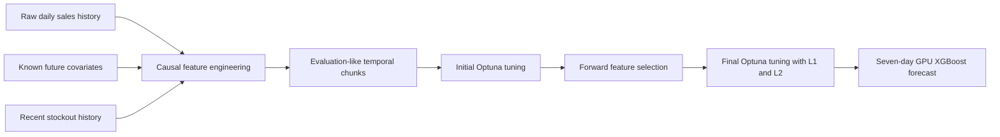

# FreshRetailNet-50K Forecasting with GPU XGBoost and Temporal Feature Selection

A full-data demand-forecasting study on **FreshRetailNet-50K** that extends the published benchmark with GPU-accelerated XGBoost, evaluation-aligned temporal validation, Optuna hyperparameter optimization, and forward feature selection.

This repository evaluates two feature-selection strategies:

1. **Mandatory start:** five predictors are imposed before forward selection.
2. **Zero start:** selection begins from an intercept-only baseline, so all 57 candidate features must earn inclusion.

Both experiments use all 50,000 store-product series and the untouched official seven-day evaluation split.

> [!IMPORTANT]
> This repository forecasts **raw recorded sales**. It does **not** reproduce the paper's TimesNet latent-demand recovery stage. The most direct comparison is therefore with the paper's raw-sales SSA, TFT, and DLinear forecasting baselines. TFT + TimesNet is included as a secondary reference showing the potential benefit of explicit demand recovery.

---

## Why this problem matters

Observed sales are not always the same as true demand. When an item goes out of stock, recorded sales drop because the product is unavailable, even though customers may still want to buy it. A model trained directly on these censored observations can learn to systematically underestimate demand.

The FreshRetailNet-50K paper introduces a benchmark designed around this problem. It contains hourly sales and stock-status information for 50,000 store-product series collected from 898 stores in 18 cities over a 90-day period. The paper reports 863 perishable SKUs and emphasizes that stockouts create a missing-not-at-random demand signal rather than ordinary random missing data [1]. The released Hugging Face dataset contains 4.5 million training rows and 350,000 evaluation rows, with sales, stock status, promotion, calendar, product hierarchy, and weather variables [2].

The paper studies two connected tasks:

1. **Latent-demand recovery:** reconstruct demand that was not observed during stockout periods.
2. **Demand forecasting:** predict the next seven days using either raw sales or recovered demand.

This repository focuses on the second task using raw sales and asks a complementary question:

> How far can a carefully validated and tuned tabular model go without explicitly reconstructing latent demand?

---

## Original paper and benchmark

The original study is:

> **Wang, Y., Gu, J., Long, L., Li, X., Shen, L., Fu, Z., Zhou, X., & Jiang, X. (2025). _FreshRetailNet-50K: A Stockout-Annotated Censored Demand Dataset for Latent Demand Recovery and Forecasting in Fresh Retail_. arXiv:2505.16319.** [1]

The authors released both the dataset and the complete baseline code [2, 3].

### Paper pipeline

The paper evaluates a two-stage framework:



### Stage 1: latent-demand recovery

During stockouts, the paper replaces censored observations with model-estimated demand while retaining observed sales during periods when stock is available. Recovery baselines include:

- TimesNet
- ImputeFormer
- SAITS
- iTransformer
- GPVAE
- CSDI
- DLinear

TimesNet is the strongest recovery model reported in the paper, achieving 27.62% WAPE and 1.43% WPE in the controlled recovery experiment. It also reduces the correlation between recovered demand and stockout ratios, which the authors interpret as improved separation of demand from supply constraints [1].

### Stage 2: seven-day forecasting

The paper evaluates three forecasting approaches:

- **SSA:** a similar-scenario statistical baseline using historical periods with comparable promotion and weather conditions.
- **TFT:** a Temporal Fusion Transformer using known future covariates.
- **DLinear:** a linear time-series model based on trend and seasonal decomposition.

Each forecasting model can be trained using either:

- **Raw pipeline:** daily totals computed directly from observed sales.
- **Recovery-augmented pipeline:** daily totals computed after latent-demand recovery.

The paper evaluates forecasting on operational periods without target-day stockouts, using WAPE for magnitude accuracy and WPE for aggregate bias [1].

---

## This repository's method

This repository does not perform hourly demand imputation. Instead, it trains XGBoost directly on daily raw sales using causal features available at each forecast origin.



### Data and forecast setup

- **Series:** all 50,000 store-product series
- **Training rows:** 4,500,000
- **Official evaluation rows:** 350,000
- **Forecast horizon:** seven days
- **Primary comparison subset:** uncensored target days, matching the paper's forecasting evaluation logic
- **Model:** XGBoost with GPU acceleration
- **Validation:** evaluation-like temporal origin chunks rather than random row splits

### Causal feature engineering

Features are constructed using information available at or before each forecast origin, plus known future covariates such as planned discounts and calendar indicators. Candidate groups include:

- recent sales levels and lags;
- rolling sales statistics;
- product and store identifiers;
- product hierarchy;
- recent stockout history;
- discounts, holidays, and activities;
- weather variables and interactions;
- forecast-horizon and calendar encodings.

### Temporal validation

The official task predicts seven consecutive future days from a single origin. To better match that deployment setting, each validation fold uses:

```text
Training: earlier forecast-origin chunks only
Validation: one complete origin containing horizons 1 through 7
Coverage: all available store-product series
```

This is more realistic than random cross-validation because it preserves time order and evaluates the model on future periods.

### Combined optimization framework

Both experiments follow the same general pipeline:

1. Tune XGBoost hyperparameters on all available candidate features using Optuna.
2. Freeze those hyperparameters during forward feature selection.
3. Test candidate features individually using the same temporal chunks within each selection step.
4. After a feature is accepted, reset the chunks and rebuild temporal folds for the next step.
5. Stop when the best remaining feature no longer improves mean negative MSE.
6. Jointly retune the final selected feature set, including L1 and L2 regularization.
7. Train the final model and evaluate it on the untouched official evaluation split.

---

## Two feature-selection experiments

### 1. Mandatory-start experiment

The first experiment begins with five features selected from forecasting intuition:

- `horizon`
- `seasonal_naive_7`
- `sales_roll_mean_7`
- `future_discount`
- `future_holiday_flag`

Forward selection then adds `store_id`.

Final feature set:

```text
horizon
seasonal_naive_7
sales_roll_mean_7
future_discount
future_holiday_flag
store_id
```

### 2. Zero-start experiment

The second experiment begins from an intercept-only baseline. This does not mean the final model uses zero predictors; it means no candidate is accepted automatically.

Selected features:

| Order | Feature | Interpretation |
|---:|---|---|
| 1 | `sales_roll_mean_7` | recent weekly demand level |
| 2 | `store_id` | persistent store-level effects |
| 3 | `rain_x_holiday` | interaction between rainfall and holiday context |
| 4 | `product_id` | product-specific scale and demand behavior |
| 5 | `future_discount` | planned promotion intensity |
| 6 | `stockout_roll_mean_14` | recent stockout and censoring pressure |
| 7 | `sales_origin` | latest observed demand state |

These features are meaningful for forecasting previously observed store-product series. However, `store_id` and `product_id` can capture identity-specific patterns, so this result should not be interpreted as evidence of cold-start generalization to unseen stores or unseen products.

---

## Evaluation metrics

The main paper-comparable metrics are:

### Weighted Absolute Percentage Error

$$
\mathrm{WAPE} = \frac{\sum_i |y_i - \hat{y}_i|}{\sum_i y_i}
$$

Lower WAPE is better. It measures total absolute forecast error relative to total observed demand.

### Weighted Percentage Error

$$
\mathrm{WPE} = \frac{\sum_i (\hat{y}_i-y_i)}{\sum_i y_i}
$$

WPE measures aggregate bias:

- negative WPE: systematic underprediction;
- positive WPE: systematic overprediction;
- values near zero: low aggregate bias.

The repository also reports MSE, MAE, and RMSE for the two XGBoost experiments.

---

## Headline results

Paper-comparable results use uncensored target days from the official seven-day evaluation.

| Sales group | Mandatory-start XGBoost | Zero-start XGBoost | Best paper raw-sales model | Paper TFT + TimesNet |
|---|---:|---:|---:|---:|
| Overall WAPE | 33.03% | **29.96%** | DLinear: 31.56% | **29.02%** |
| Low-sale WAPE | 38.94% | **36.10%** | TFT: 37.04% | 37.33% |
| High-sale WAPE | 28.74% | **25.50%** | DLinear: 25.68% | **23.03%** |
| Overall WPE | -5.13% | -6.82% | DLinear: -4.89% | +2.58% |
| Low-sale WPE | +3.11% | **-1.15%** | DLinear: -1.03% | +7.78% |
| High-sale WPE | -11.12% | -10.93% | DLinear: -7.63% | **+0.87%** |


### Main findings

- Zero-start XGBoost improves WAPE, MSE, MAE, and RMSE over mandatory start for overall, low-sale, and high-sale groups.
- Zero-start XGBoost outperforms all paper raw-sales forecasting baselines in WAPE:
  - 1.60 percentage points better than raw-sales DLinear overall;
  - 0.94 points better than raw-sales TFT for low-sale series;
  - 0.18 points better than raw-sales DLinear for high-sale series.
- Compared with the paper's different two-stage TimesNet + TFT pipeline:
  - zero start is 0.94 points worse overall;
  - 1.23 points better for low-sale series;
  - 2.47 points worse for high-sale series.
- The main remaining limitation is high-sale underprediction. Zero-start WPE is -10.93%, while TFT + TimesNet is close to unbiased at +0.87%.

The full ranking, pairwise differences, relative improvements, and bias analysis are available in [`docs/PAPER_COMPARISON.md`](docs/PAPER_COMPARISON.md).

---

## How to interpret the TimesNet comparison

TimesNet + TFT should not be treated as merely another forecasting model in the same model class.

### Paper's recovery-augmented pipeline

```text
hourly observed sales
+ hourly stock status
+ promotion, weather, and calendar covariates
        -> TimesNet latent-demand recovery
        -> recovered daily demand
        -> TFT forecasting
```

### This repository's raw-sales pipeline

```text
raw observed daily sales
+ causal engineered features
+ recent stockout indicators
        -> GPU XGBoost forecasting
```

`stockout_roll_mean_14` tells XGBoost that recent observations may have been affected by stockouts, but it does not estimate the sales that would have occurred if inventory had remained available. The target therefore remains censored raw sales.

Consequently:

- the primary apples-to-apples comparison is against **SSA raw**, **TFT raw**, and **DLinear raw**;
- TFT + TimesNet is a useful secondary benchmark for understanding the value of explicit latent-demand recovery;
- the high-sale comparison suggests that recovery is especially helpful where stockout-related censoring and demand volume are strongest;
- this repository does not claim to reproduce, replace, or validate the TimesNet recovery model.

See [`docs/TIMESNET_SCOPE.md`](docs/TIMESNET_SCOPE.md) for the complete scope statement.

---

## Why zero-start selection is useful

Starting from zero features is a valid feature-selection ablation because the first model is an intercept-only baseline, not the final forecast model. It forces every predictor to demonstrate incremental value.

The result suggests that several intuitively reasonable mandatory predictors were redundant after stronger store, product, recent-sales, stockout, promotion, and interaction features were considered.

However, there is an important limitation: the executed notebooks reset temporal chunks after accepted features and use the historical `uploaded_notebook` acceptance rule. Candidate rankings within each step use the same folds, but reported improvements across different resets are not perfectly paired. A stricter `same_reset_baseline` configuration is included under `configs/` for a future confirmatory experiment.

---

## Repository structure

```text
notebooks/
  01_mandatory_start.ipynb
  02_zero_start.ipynb
  03_paper_comparison.ipynb
  executed/                    completed runs with outputs
results/
  paper_benchmark_table3.csv
  full_benchmark_ranking.csv
  pairwise_comparison_vs_each_paper_model.csv
  mandatory_vs_zero_start.csv
  our_evaluation_all_subsets_and_horizons.csv
  horizon_comparison_uncensored_overall.csv
  feature_selection_path.csv
  selected_features_and_interpretation.csv
  hyperparameters.csv
docs/
  PAPER_COMPARISON.md
  TIMESNET_SCOPE.md
  FEATURES.md
  METHODOLOGY.md
  LIMITATIONS.md
  REPRODUCIBILITY.md
figures/
scripts/
src/
tests/
configs/
```

---

## Reproducing the experiments

The dataset is loaded directly from Hugging Face and is not redistributed in this repository.

```python
from datasets import load_dataset

dataset = load_dataset("Dingdong-Inc/FreshRetailNet-50K")
print(dataset)
```

Recommended workflow:

```bash
pip install -r requirements.txt
pytest
python scripts/build_figures.py
```

Then run either clean experiment notebook from top to bottom in a Colab GPU runtime.

The complete search is computationally expensive because it evaluates:

- all 50,000 series;
- multiple temporal folds;
- 57 individual candidate features;
- initial Optuna tuning;
- iterative feature selection;
- final Optuna tuning with regularization.

See [`docs/REPRODUCIBILITY.md`](docs/REPRODUCIBILITY.md) for full instructions.

---

## Scope and limitations

- TimesNet latent-demand recovery was not reproduced.
- Raw recorded sales remain censored during historical stockouts.
- The comparison with raw-sales paper models is more direct than the comparison with TFT + TimesNet.
- Store and product identifiers support seen-series forecasting but do not prove cold-start transfer.
- Feature-selection improvements across reset steps are not perfectly paired under the executed acceptance rule.
- Results come from one main random seed rather than repeated-seed confidence intervals.
- Hyperparameter tuning, feature selection, and final model choice are coupled.

See [`docs/LIMITATIONS.md`](docs/LIMITATIONS.md) for the detailed discussion.

---

## Data, code, and citation

### Original resources

1. **Paper:** [FreshRetailNet-50K: A Stockout-Annotated Censored Demand Dataset for Latent Demand Recovery and Forecasting in Fresh Retail](https://arxiv.org/abs/2505.16319)
2. **Dataset:** [Dingdong-Inc/FreshRetailNet-50K](https://huggingface.co/datasets/Dingdong-Inc/FreshRetailNet-50K)
3. **Official baseline code:** [Dingdong-Inc/frn-50k-baseline](https://github.com/Dingdong-Inc/frn-50k-baseline)

### BibTeX

```bibtex
@article{wang2025freshretailnet50k,
  title={FreshRetailNet-50K: A Stockout-Annotated Censored Demand Dataset for Latent Demand Recovery and Forecasting in Fresh Retail},
  author={Wang, Yangyang and Gu, Jiawei and Long, Li and Li, Xin and Shen, Li and Fu, Zhouyu and Zhou, Xiangjun and Jiang, Xu},
  journal={arXiv preprint arXiv:2505.16319},
  year={2025},
  doi={10.48550/arXiv.2505.16319}
}
```

### Licenses and attribution

- The FreshRetailNet-50K dataset is released under **CC BY 4.0** [2].
- The official baseline repository is released under **Apache-2.0** [3].
- This repository is an independent extension focused on GPU XGBoost, structured temporal validation, Optuna optimization, and forward-feature-selection ablations.

